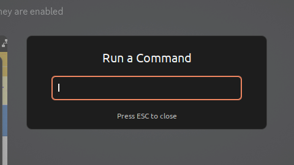
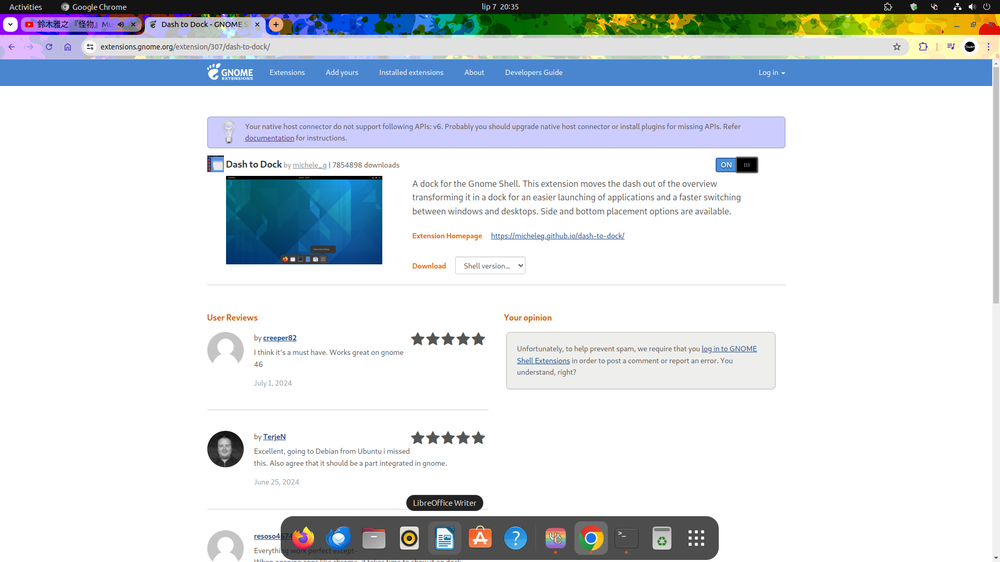
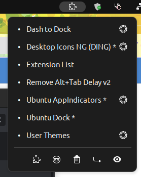
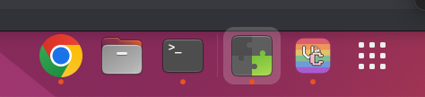
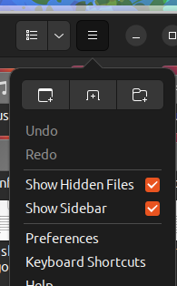
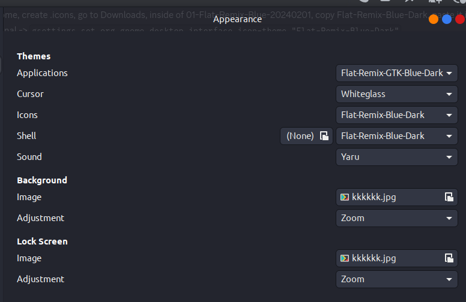
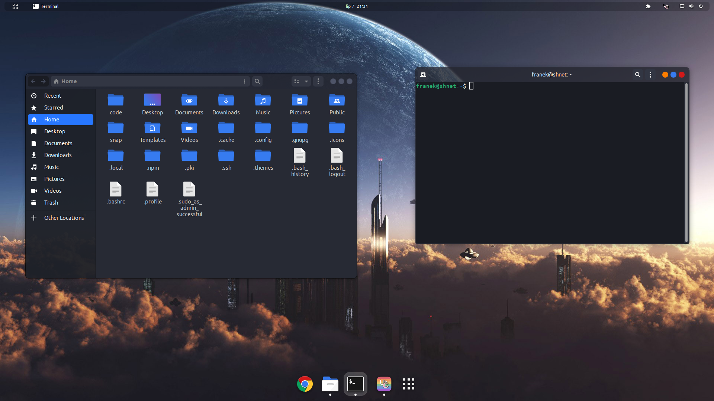

Be vary though that while dualboot sounds nice and all, there's one risk associated. It's that you must never access Ubuntu from Windows. Like, if you go on Windows, and you go into file explorer, NEVER try to open the Ubuntu partition in it. You will seriously screw it up by doing this. The filesystems of Windows and Linux are not compatible, which by itself is not a problem if you support both like Linux, but Windows only supports its own filesystem.

There's many dualboot tutorials online, so I won't get into the nitty-gritty here. You can do that by yourself with credible sources. I will however explain it a bit to you, and provide steps of what to do after having the system up.

First of all, you need a USB stick, at least 8GB. Get the [Ubuntu 22.04 ISO](https://releases.ubuntu.com/jammy/ubuntu-22.04.4-desktop-amd64.iso). There's newer Ubuntu versions, but in my experience they are quite unstable, so just stick to that for now.

Get something alike [Rufus](https://github.com/pbatard/rufus/releases/download/v4.5/rufus-4.5.exe). You will need it to "burn" the Ubuntu ISO file onto your USB stick.

Once you do that, plug your USB in, reboot your PC. When it boots up, a lot of BIOSes show what key you have to press to get into it, like DEL (depends on BIOS). Smash that key until you get in. If you didn't, just reboot and try again. BIOS is the software that is responsible for actually loading the operating system and starting up your computer. When inside of its settings, navigate to the boot order, and change it so that your USB stick is the first spot on it. Then save changes, quit.

Now, you will be in Ubuntu, but it's only on your USB. Any changes you make here won't affect your disk or even your USB as when you restart, all changes will be lost. However note that if you do something specific like mount your disk, then of course you can make some changes "manually".

It will offer you an installation. Proceed with it. Ubuntu will by itself detect the existing Windows installation and will offer to install itself alongside. Proceed with that. When it asks for additional software, install it, and also disable updates during installation (we will do that later).

That's basically it. Consult full tutorials online to see the nitty-gritty details. This was the outline.

As for the customization of Ubuntu, here's steps I have taken during my last Ubuntu installation. They are not organized, quite chaotic even, so, well, don't mind that. From now on, text in `this form` means commands to be executed in terminal. Just copy paste it or something. Do not try to paste multiple commands at the same time, execute them one by one in the right order.

First, give your system after boot like 5 minutes or so, there may still be some things running after installation like system updates.

If any command after execution asks for confirmation, press enter to continue.

If your Ubuntu seems frozen, but you can move your mouse around, press Alt + F2, then type `r` in the box that appears in the center:

Go to settings (top right). Go to sound. Mute system sounds (click on the speaker to the right to mute).

`sudo apt update && sudo apt upgrade`

Ubuntu comes with Firefox by default. You can launch it from the bar on the left. Then proceed to [download Chrome](https://www.google.com/chrome/). Once the download has completed, `cd ~/Downloads; sudo dpkg -i goo` and press Tab to autocomplete the file name, then press enter. That will install Chrome and you can start using it immediatelly afterwards.

`sudo apt install python3-pip npm`

`sudo npm i n -g`

`sudo n lts`

`hash -r`

That will get you python3 and nodejs. For some reason you should already have python3 but not the package manager (??) so yea.

`sudo apt install gcc-12 gcc clang`

`sudo add-apt-repository ppa:ubuntu-toolchain-r/test`

`sudo apt update && sudo apt upgrade`

`sudo apt install pipewire-media-session- wireplumber`

`systemctl --user --now enable wireplumber.service`

`sudo apt install pipewire-audio-client-libraries`

`sudo cp /usr/share/doc/pipewire/examples/alsa.conf.d/99-pipewire-default.conf /etc/alsa/conf.d/`

`sudo apt install pipewire-pulse`

`sudo apt install libldacbt-{abr,enc}2 libspa-0.2-bluetooth pulseaudio-module-bluetooth-`

`reboot` (this will restart your system)

`sudo apt install g++-13 clangd-15 clang-tidy-15 clang-format-15 clang-15`

`sudo apt install gnome-tweaks chrome-gnome-shell`

Go [here](https://ubuntu.com/pro), create an Ubuntu account, sign up for Pro (it's free), then click top right on Account -> Ubuntu pro dashboard -> free personal token. There will be a command there like `sudo pro attach <token>`, execute it.

`sudo apt update && sudo apt upgrade`

Get [this](https://chromewebstore.google.com/detail/gnome-shell-integration/gphhapmejobijbbhgpjhcjognlahblep) Chrome extension, then go [here](https://extensions.gnome.org/). Find and install (by clicking on OFF) the following extensions:

- User themes

- Extension list

- Remove alt+tab delay v2

- Dash to dock

Your Ubuntu should now look like this:

As you can see, there's a puzzle piece icon in the top right. When clicked on, it shows your extensions, and if there's a dot to the left of their name it means they are active. There's also a cogwheel on the right that takes you to the extension's settings. It should look just like this:

Go to settings of Desktop Icons NG. Disable `show the personal folder in the desktop` setting.

Go to settings of Dash to dock. First, navigate to the Position tab at the top (there's 4 tabs). Set icon size limit to 48. Then go to Launchers tab and deselect `show trash can` in it. Next, go to Appearance tab. Set custom opacity to `fixed` and opacity to `0%`. Set `Customize windows counter indicators` to be `dots`. Set `Customize the dash color` to white.

Right click on icons on the dash and unpin/pin them so that only Chrome, Files, and Terminal are pinned:

Download this image, right click, set as wallpaper (if you don't have anything better):

Run `echo $XDG_SESSION_TYPE`. If it says Wayland, log out in the top right, click on your profile, and in the bottom right there's gonna be a cogwheel. CLick it and change selection to `Ubuntu` (given `Ubuntu on Wayland` was selected), then log back in.

`sudo apt install libglib2.0-dev-bin imagemagick`

Download `flat-remix.tar.xz` that is in this directory. Go to files, Downloads, and move the flat-remix archive from Downloads to your Home directory. Then right click it and `Extract here`. It should create 2 new invisible folders called `.icons` and `.themes`. Confirm that they are there by clicking 3 lines in the top right of Files and selecting `Show hidden files`:

Deselect the option after you've confirmed the existence of the folders.

Click the three dots on your dash at the bottom to go to application menu. Search for "Tweaks" and open the program. Navigate to Appearance. Set it so that it looks like this (except the image file names of course):

In fonts, change the monospace font to `Inconsolata` size 13.

`reboot`

Your ubuntu should look like this now:

Get [code](https://code.visualstudio.com/sha/download?build=stable&os=linux-deb-x64).

`cd ~/Downloads; sudo dpkg -i code`, press Tab to autocomplete, enter.

`sudo apt install curl nano htop fuse openjdk-21-jdk perl autoconf nasm automake gperf autogen guile-3.0 gettext m4 gawk fonts-noto g++-12 fonts-inconsolata gcc-multilib g++-multilib`

Get [steam](https://cdn.akamai.steamstatic.com/client/installer/steam.deb) if you want now. `sudo dpkg -i steam.deb`. Opening steam after this will make it ask you to install additional packages to make it work. Just press enter and go along with it.

Once that's done (or if you skip it), delete any desktop icons if you see any, it looks better without them.

Click o nthe shield icon top right with a bit of green on it -> Livepatch settings -> disable `Show Livepatch status in the top bar`.

`curl --proto '=https' --tlsv1.2 -sSf https://sh.rustup.rs | sh`

`sudo update-alternatives --install /usr/bin/gcc gcc $(which gcc-13) 60`

`sudo update-alternatives --install /usr/bin/gcc gcc $(which gcc-12) 50`

`sudo update-alternatives --install /usr/bin/gcc gcc $(which gcc-11) 40`

`sudo update-alternatives --install /usr/bin/g++ g++ $(which g++-13) 60`

`sudo update-alternatives --install /usr/bin/g++ g++ $(which g++-12) 50`

`sudo update-alternatives --install /usr/bin/g++ g++ $(which g++-11) 40`

`sudo update-alternatives --install /usr/bin/clang clang $(which clang-15) 60`

`sudo update-alternatives --install /usr/bin/clang clang $(which clang-14) 50`

`sudo apt install flatpak`

`sudo apt install gnome-software-plugin-flatpak`

`flatpak remote-add --if-not-exists flathub https://dl.flathub.org/repo/flathub.flatpakrepo`

If you want OBS Studio, run `flatpak install flathub com.obsproject.Studio`

`reboot`

`sudo apt install gnome-control-center`

Click 3 dots in the top right of terminal -> Preferences, then click on the Unnamed profile (should be the only one there). Go to Scrolling tab, disable the scrollback limit.

`sudo apt install dotnet-runtime-6.0`

`sudo apt --fix-broken install`

`cd /tmp && wget https://apt.llvm.org/llvm.sh && chmod u+x llvm.sh && sudo ./llvm.sh 18 all && cd -`

`sudo update-alternatives --install /usr/bin/clang clang $(which clang-18) 70`

`sudo update-alternatives --install /usr/bin/clang-format clang-format $(which clang-format-18) 50`

`sudo update-alternatives --install /usr/bin/clang-tidy clang-tidy $(which clang-tidy-18) 50`

`sudo update-alternatives --install /usr/bin/clangd clangd $(which clangd-18) 50`

`sudo apt install libeigen3-dev libsdl2-2.0-0 libsdl2-dev libvulkan-dev vulkan-validationlayers vulkan-validationlayers-dev vulkan-tools libfreetype6-dev libc++-dev`

`sudo update-alternatives --install /usr/bin/clang++ clang++ $(which clang++-18) 70`

`sudo update-alternatives --install /usr/bin/clang++ clang++ $(which clang++-15) 60`

`sudo update-alternatives --install /usr/bin/clang++ clang++ $(which clang++-14) 50`

`sudo apt install build-essential cmake libzstd-dev ninja-build doxygen libsdl2-dev libgl1-mesa-glx libgl1-mesa-dev libvulkan1 libvulkan-dev libassimp-dev opencl-c-headers mesa-opencl-icd libc++-dev git make pkg-config cmake ninja-build gnome-desktop-testing libasound2-dev libpulse-dev libaudio-dev libjack-dev libsndio-dev libx11-dev libxext-dev libxrandr-dev libxcursor-dev libxfixes-dev libxi-dev libxss-dev libxkbcommon-dev libdrm-dev libgbm-dev libgl1-mesa-dev libgles2-mesa-dev libegl1-mesa-dev libdbus-1-dev libibus-1.0-dev libudev-dev fcitx-libs-dev libpipewire-0.3-dev libwayland-dev libdecor-0-dev`

`cd /tmp && git clone https://github.com/libsdl-org/SDL --depth 1 && cd SDL && mkdir build && cd build && cmake -DCMAKE_BUILD_TYPE=Release .. && cmake --build . --config Release --parallel && sudo cmake --install . --config Release && cd -`

`ssh-keygen`

`sudo apt autoremove`

Good enough for starters.

[←](../env/env.md)
