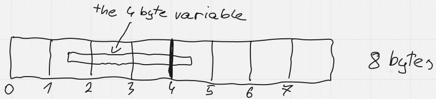
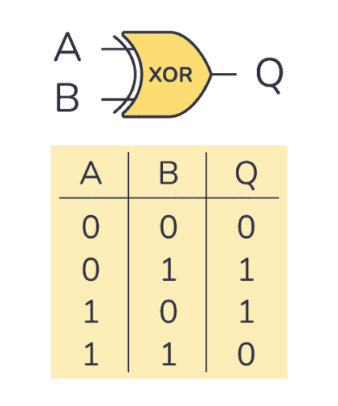

Create a directory called `x86`, then inside of it create some file like `hello.s`. If a file has the `s` extension, it means it's assembler source code.

Click the 4 squares-like icon on the left bar of vscode. That's where extensions are. Get `x86 and x86_64 Assembly` extension (install it), and restart vscode.

A program consists of a couple of parts, or sections. There's the code section, which is probably the easiest for you to grasp. That section has the professional name of `text`. Then, there's data sections. Data sections are necessary for either items that are often used by the program and thus should be deduped into a single place instead of scattered around the code, or constants that you should be able to change easily, or just memory space for the program to work with, like empty arrays (more on these later).

There's three primary data section types:

- `data` is for initialized variables,

- `bss` is for uninitialized variables (contents usually zeroed),

- `rodata` is for constants (implicit initialized).

You usually put different things in different sections. For large spaces of memory to be used during program execution, you would likely use `bss`. Other than that, the distinction between `data` and `rodata` should be rather obvious (variable and constant).

Let's throw you into the deep water right off the bat to explain a lot of things in one move. Copy paste the following code into your `.s` file:

```assembly
section .bss
buffer:		resb	128

section .rodata
greeting:	db	'Hello, world!', 10

section .text
global _start

_start:
	; Write the greeting to stdout
	mov eax, 4		; sys_write
	mov ebx, 1		; file descriptor (stdout)
	mov ecx, greeting	; pointer to the string
	mov edx, 14		; length of the string
	int 0x80		; call kernel

	; Exit the program
	mov eax, 1		; sys_exit
	xor ebx, ebx		; exit code 0
	int 0x80		; call kernel
```

That's what you would see in an actual coding environment. Obviously, you don't understand any of this gibberish, so let's explain it line by line.

First of all, use tabs for indentations, always. In assembly, use tab size 8. In other languages I personally use 4, but it's up to preference.

Right off the bat you can see how sections are denoted. At the start of a section, you simply say `section .section_name`, and the section continues until some other section begins, otherwise it lasts until the end of the file.

In all data sections, the syntax is roughly the same:

```assembly
label:	storage_type	initial_value
```

Labels are an integral part of assembly. They allow you to create an alias for a certain line of code. Behind the curtains, everything you write is stored somewhere in memory, and labels then become, simply speaking, a number that denotes where in memory a given thing is/starts. A memory is just a list of cells that we call bytes. The first byte is located at address 0, and the highest - at whatever is the size of your RAM, or some other memory like disk or cache.

After a label comes the type. In low-level languages, or otherwise "strongly typed languages", the programmer needs to explicitly state the type of a memory region or a number. When it comes down to it, it's all numbers. When talking about memory regions, you really are specifying the type for what lies under a certain label or a memory address, so that the CPU knows how much data to fetch from where and how to interpret it.

And lastly, after the type comes the initial value. For `bss`, you would rather state the length of the region (which, multiplied by the width of the type results in the total byte size of the region) rather than specify a value (since it's a region for uninitialized variables).

Let's move onto the `bss` section. We create a label `buffer` that points to 128 of `resb`. `resX`, where `X` is a wildcard, stands for `reserve X`, or in other words, you are saying you want a certain amount of `X`, but you're not initializing it with anything in particular. In this case, `b` means `byte`, so basically we're reserving 128 bytes of memory under the label `buffer`, and that's it. We can then reference the label later in the program to do something with that memory.

Note that when you have some amount of items of a certain type linearly in memory, you call that an array. Linearly means there's no gaps, the items are next to each other, because otherwise it's more like a list than an array. An array is identified by its beginning, and often also by its length, however sometimes there's other ways to denote its ending - like by a special item at the end that is guaranteed to occur exactly once and is used specially for the sole purpose of denoting the end of an array. That is because sometimes with certain types of arrays, whenever you want to access them, you want to access them whole, not just one item from them, which is why it's useless to know the length in advance, because you will learn it anyway if you go through the entire array, or you just straight up don't need it at all. And in that case, storing the length is just a hassle and a waste.

And that is precisely the case with strings. Strings are, you could say, simply an array of characters, or letters. A string that does not have a length and is instead denoted by a NULL character at the end (which is simply zero) is called a C string, and it's what is widely used in the world of programming, literally e v e r y w h e r e. It's de facto the standard. Think about it. When using strings, it's very rare for you to just, randomly access one or two characters in said string in predetermined locations. What you often do with strings however, is copying them to a different location, which is realized by going through the entire string until the NULL terminator and transfering byte by byte to a different location, and comparing with other strings, which again requires going through them, so if you're at it (at going through the strings from beginning often to the very end), why do you have to know the length? You go through every character anyway, so it's much more beneficial to just check if the character is NULL, if it is then job is done, if it isn't then you continue, and in this case all you have to work with is the string itself, no external data like the string's length needed.

So, when you hear a string or a C string, from now on associate it with a NULL-terminated array of characters. These characters we're talking about are bytes, so they are [ASCII](https://en.m.wikipedia.org/wiki/ASCII). Of course, you can put Unicode in there, you can even create a 16 bit or 32 bit type array so that you could use so called "w i d e" strings (used in asian countries, Java, JavaScript), but that doesn't change the fact it's NULL terminated, so the last character in the sequence is a zero. This doesn't always have to be the case - you can of course create strings with preallocated size so that you don't need that NULL character, or you can just invest in a length variable, but most of the time we're talking about a NULL terminated array, and for the sake of simplicity it will be an array of plain old bytes.

There's other uninitialized array types than just `resb`, and they all derive their naming from what we've talked about words. Essentially:

- `b` - `byte`

- `w` - `word`, or 2 bytes

- `d` - `double word`, or 4 bytes

- `q` - `quad word`, or 8 bytes

- `t` - 10 bytes

- `o` - `octa word`, or 16 bytes

- `y` - 32 bytes (same as YMM registers)

Now, you should use the type that suits your item size in the array perfectly. If there isn't a type like that, fallback to `resb`. Remember that the total length of the region is the length you specify after the type multiplied by the width of the type as specified above, so for different types you will want a different array length to achieve the same memory region size.

The types other than `resb` aren't really that important if it wasn't for alignment. See, while Intel CPUs don't have much issue with reading data that isn't aligned, some other CPUs do and they can kill your program if you do it. Alignment is an important topic, so let me explain.

When you have a data type that is 4 bytes, you will want to store it only on addresses that are a multiply of 4. That is because if you store it on, for instance, a multiply of 2, you might suffer from slower reads and writes, because the CPU might be required to perform a couple of instructions to achieve the same effect. That is best visualised:



As you can see, the 4 byte variable was placed without any restrictions (or, in other words, on a 1 byte aligned address). It spans from address 1 to 4 inclusive. It would be ideal if it was at address 0 or 4, but it's on 1. This means that the CPU might need to perform 2 read operations - first, read the 4 bytes starting at 0, and then read the 4 bytes starting at 4, or it might be a bit smarter than that and read just that one byte at address 4. Anyhow, it will then load these into the registers, and will need to coalesce them together into one via some operations. In comparison to just reading once and being done with it, this is quite cumbersome.

To mitigate this, either use the `align` keyword in NASM (which you shouldn't for now), or use proper types so that the assembler does the proper alignment by itself. You might also sometimes need to expand your item size in an array to make sure the whole structure is aligned. This can happen when in one item (structure) you have many different types of data. You should take care of not just their alignment as a whole, but also individually. You can read more about data alignment [here](https://en.m.wikipedia.org/wiki/Data_structure_alignment). More on structure alignment later, when we get to the C language.

That was a lot of information, so let's chill down a bit. Next in line is the `rodata` section. There's only one entry, the label is `greeting`, the data type is marked as `db`, which means `define byte`. As with `resX`, there's a `dX` convention, where the `X` can be `b`, `w`, `d`, `q`, etc. And after the type, you specify the initial value. In this case, it's a string. Note how you can specify multiple values separated by a comma, if your data is an array. The newline (`\n`, the ASCII code is 10) is there so that terminal properly shows the output. There's no terminating NULL byte, the reason for which will be explained later.

Next in the code is the `text` section. Here, as it was mentioned before, you put your code. You naturally can use labels here too, and even must do so, at least to specify where your code begins. If you want to run an assembly program standalone, you must provide a label that's called `_start` that will point to where your program should start were it executed. If you couple assembly with other languages that already provide an entrypoint themselves, you can name your functions anything and for instance call them from the other languages. However, to do that, just like with `_start`, you must first make sure the labels are visible externally. This is because assembly often produces a lot of labels that are there for the programmer only - like labels for data, or loops in the code (more on that later). Very often, only a couple of labels are for actual pieces of code that should be referenceable externally. This is why by default all labels have hidden visibility (hidden outside of the file where they are defined), and to show them to the outside world, you must do so via `global <label_name>`.

Next, the label for `_start`! This is the beginning of the program. The start of your program doesn't have to be at the top of the `text` section - it could be literally anywhere.

Labels in code reference the instruction after the label itself. If you go to a label, it means you go to the place before the instruction, and resume execution there, so that the instruction is next in line to be executed. When the system executes a program, it simply jumps to the `_start` label to start it off. Later on you will also learn how to jump to labels by yourself to form complex program flow.

Next, we have a comment. All comments in NASM begin with a semicolon (`;`). You should comment your code! Of course, when you write code by yourself, you will know every detail of it and won't really need comments... for now. When you switch projects or just leave the code for a while, it's very probable you will forget what you meant at certain places. It's good practice not only for yourself to not get lost within your own code, but also for others to know what you meant by writing something. Especially when smoe sketchy stuff is going on, like a shady bug fix that otherwise is gibberish, or when the flow of the program is complex. More on flow later.

Note that "stdout" means standard output. "stdin" would mean standard input. Typically, "std" is an abbreviation for "standard".

And finally, instructions. In x86, instructions can be argumentless, accept one argument, or two. If they accept two, the convention is to first specify the destination, and then the source. So, usually, this is what is happening:

```assembly
label:	instruction	destination	source	; comment
```

Labels should be descriptive and not just abbreviations. That's why you can also evolve your code to look like this:

```assembly
long_and_descriptive_label_name:
	instruction	destination	source	; comment
```

It's quite common to do that, but if you do, it's better to stick to one style, so if you do it for long names, might as well do it for short names.

Keep mind of the text alignment, the tabs and spacing. You should keep your code tidy, like your room. The more you take care of it, the better it will serve you, and the more extendable and understandable it will be.

In the code that follows, there's 3 different instructions - `mov`, `int`, and `xor`.

`mov` is quite plain and simple. It moves the source to the destination. There's nothing elaborate about it, but note that both source and destination can be a couple of different things. You can specify a numeral constant (only for source), or a label (but note that if you move a label somewhere, it basically means moving the address to whatever lies under that label in text form!), or a memory location (like, you can literally specify an address, not just a label because you know labels ahead of time, we're talking about dynamic addresses here), or a register, or an expression, and that's about it.

So, at first, we're moving the number `4` into the register `eax`. `eax` is a 32 bit register, like all `eXx` registers. Later on, we're moving `1` into `ebx`, and then `greeting` into `ecx` (the address to what's under `greeting`), and finally `14` to `edx`.

All of this is just a setup to `int 0x80` that follows. That instruction is special in the sense that it sends an interrupt that wakes up the kernel and asks it to kindly do something. That "something" is identified by the number `4` in `eax` which stands for `sys_write` function that sends some data to our program's output that then can be displayed by the terminal. Then, the kernel reads `ebx` to learn which stream we want it to write data to, and in this case it's `1`. This maps to the standard output, because by default when a program is executed, the kernel creates 3 default streams for it - `0` stands for the standard input, `1` stands for the standard output, and `2` stands for the error output. So, we're selecting the standard output. After that, in `ecx` the kernel expects a pointer (address) to the data to put in the stream, and in `edx` the length of it. That's because we're talking about raw binary data here, not strings. It could be a string, but there's no notion of a NULL terminated array - it's up to us, the kernel doesn't care. So we put the address to our data denoted by the label `greeting` and the length in the specified registers, and we're done.

These 5 instructions together manage to print `Hello, world!` in the program's output, which you will see by yourself later on. At the end of the program, we just do some cleanup - have to tell the kernel we finished and want to exit. If you don't do that, well, the behavior is undefined. The CPU is a mindless machine that simply executes instructions one after another, so it will keep going after the last instruction we've written, read whatever content is after the code, even if its gibberish. Eventually, the kernel will kill the program for accessing memory it's not supposed to.

The function code for `sys_exit` is `1`. Then we would like to specify the code. As mentioned before, zero means success, anything else is a failure, so we want a zero. For this, we could do `mov ebx, 0`, or we could do `xor ebx, ebx`. You will often see code where there's a `xor` operation on the same register. A xor operation looks like this:



So, essentially, if the bits differ it's a `1`, if they are the same it's a `0`. Note what I just said? If they are the same, it's a zero, so if we just xor the same register with itself, no matter what its contents were before - the result will always be zero.

Then just do `int 0x80` to notify the kernel, and boom, any instructions after that are unreachable, meaning the program must have exited at the previous instruction no matter what, so any instructions after that are superfluous.

`int 0x80` is an older, 32 bit way of calling the kernel. There exists a newer way - `syscall`, which enables more registers to be used as arguments and is overall meant to be more efficient, but we're not gonna dive into that. You can look it up yourself later, once you've become more experienced with assembly.

That about sums up this piece of code. You can go ahead and assemble it now using the following command:

```shell
nasm -f elf64 hello.s
```

It will assemble the specified text file into an object file that you can then later link either standalone or with other object files in case your project is split across many of those. In return, you get a `hello.o` file in the same folder. Note that the command is suited only for 64 bit machines (thus the flag `-f elf64`).

Afterwards, to link the object file, use:

```shell
ld hello.o -o hello
```

Linking is a process that involves resolving addresses in object files. If you have files that reference each other, this step is important to let the different files actually merge with each other. In text form, you just say "trust me on this bro, there's a label like this and I want to do something with it", but linker actually verifies that and forms the connection. These addresses are resolved for so called symbols, which basically means some variable or a label. And of course, it also merges all of the segments of all of the object files together to form one coherent program.

That will produce the final executable called `hello` in the same directory (the `-o` flag stands for output file name, specified after it). You can then run it:

```shell
./hello
```

And observe the output.

Note that there's a lot more kernel functions than just write and exit. You can see them online, for instance [here](https://chromium.googlesource.com/chromiumos/docs/+/master/constants/syscalls.md#x86-32_bit), though note that you don't want to use these functions directly from assembly most of the time, except the simple ones. You will be able to use these easily from C once we get there. For now, endure some assembly pain and learn that deep down it's all numbers and very basic operations.

[←](../x86/x86.md) | [→](../x86_instructions/x86_instructions.md)
