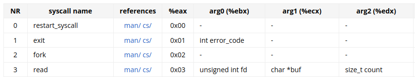

Last time I've explained some basic assembly syntax as well as how a simple program might behave. Let's dive slightly deeper into how a program - kernel relationship works.

Kernel is what runs barebone on the machine, almost. Before it there's BIOS, and it does the setup initialization of devices including the CPU, after which it relinquishes control to the kernel after finding one. When you run a dualboot setup, the BIOS first gives control to the bootloader, which gives you an option to pick the kernel you want to go with. These "programs" disappear after their job is done, and eventually kernel is the only thing running.

Kernels are dead beings. This is quite important to understand so that you know what asynchronous really means deep down. Synchronous is when you drive in your own lane, don't look back or to the sides, don't mind other drivers, just go ahead, instruction by instruction. You never change lanes. Asynchronous is when other drivers might be a threat to you, or when you have to switch lanes. If you were an electronics engineer you might know that async circuits are usually faster than sync ones when done correctly, and you can also relate to what sync and async mean. If you don't, then here's a more in-depth explanation.

Synchronous circuits have a clock or multiple clocks that steer one or multiple components like SR flip flops. Assume just one clock for now. You calculate what the maximum propagation time is through the circuit and promptly set the clock's speed to it or slightly above. Everything works in rhythm with the clock then.

Asynchronous is when you get rid of the clock. Input is what steers the circuit and the state of it. This allows for faster operation and allows components to work in parallel, but also introduces new problems like race conditions, where spikes in output can occur when for nanoseconds certain paths in the circuit might process data faster than others, which can create a butterfly effect down the line too. Inputs can arrive at any time and you are only bothered when they actually do. Otherwise, you do nothing, since there's no clock to constantly poke you with a stick.

CPUs are synchronous state machines, which means they have a clock that dictates the components. We've covered this a bit before. If your CPU speed is 4GHz, one tick is 0.25 nanoseconds. That's one internal tick of the CPU. Different instructions can have different execution speeds, spanning a various amount of ticks, but this is the indivisible unit, a tick.

CPUs only have their clocks, and interrupts. Interrupts are lines connected to the CPU that can be raised when a device wants to communicate with the CPU, like when an event occurs. Think of this like a key being pressed on the keyboard, or a packet arriving over the network. The devices, or components, associated with the process detect an abnormality, they process it, and then report it to the CPU. This is done by the interrupt lines, via interrupt requests, or [IRQ](https://en.m.wikipedia.org/wiki/Interrupt_request)s. You don't really have to know exactly how it's done deep down. Just know that it is done.

When a CPU notices an interrupt, it immediatelly brings up the kernel. A kernel, when it's setting the machine up, also (besides BIOS) has plenty of stuff to configure on the CPU, like paging, virtual memory, or interrupts. There's usually multiple interrupts, so it keeps a table of functions that should be called for a specific interrupt. That table is then accessed by the CPU, a function call is made, and boom, the kernel is now in control. Note that there's still some wording you don't know, like functions, but that will be explained later.

And that's it. The clock and interrupts. That's all the kernel has to work with. Of course, there's memory too, and memory is how the kernel communicates with outside world (devices), but you can't make the kernel appear out of the blue using just memory. And also, to be frank, the CPU clock is kind of an interrupt too. So it's just interrupts.

The kernel does nothing most of the time. When it's doing something, it's only because a userspace program asked it to do something via a system call (`int 0x80`), or because there was an interrupt. That's it. There are no other options. The kernel is a *dead being*. It only lives when there's something to do. After it deals with that something, it goes back to not existing.

CPUs have evolved over the years to be very kernel friendly. They support a lot of cool things for kernels to use, and sadly you probably won't be ever using or seeing these things unless you write a kernel or work on one. While the CPU keeps constantly running, generating clock interrupts and executing any instructions there are, making memory requests and whatnot, the kernel can sit back, relax, wait for it to notify it if anything happens. That's just how it is.

There's the kernel, and the userland, or userspace. These 2 represent 2 of the usual 4 CPU protection rings. CPU rings are kind of like, well, modes of CPU operation. You can read more about them [here](https://en.m.wikipedia.org/wiki/Protection_ring). In a nutshell, kernel runs in the most priviledged ring that has access to everything the CPU has to offer. Then there's the middle rings, with each one away from the center (the kernel) having less and less priviledges, with the userspace being the outermost ring with the least priviledges. This means for instance restricted access to instructions or CPU registers, as to not do something you aren't allowed to, like modify virtual memory tables. If a CPU detects you trying to do something you're not supposed to due to your priviledges as a program, it will notify the kernel about it, and the kernel will be left the decision of what to do with it. Usually, the kernel simply kills the program, or terminates it. Sometimes there's a way to intercept the moment of the kernel wanting to kill you, and you can try to deal with it, but it's not always possible, when you've done something that can't possibly be overlooked or repaired. The CPU will also catch you red handed if you try to access memory you don't own, or when you try to divide by zero (yes, it's kind of funny). The middle protection rings are very rarely used, and if at all, it's only for stuff like device drivers or system servers.

Wheef, that was a lot of information. So basically, your code will most of the time run in the userland, you must listen to the kernel and kindly ask for favours like access to the filesystem or memory, and beg that you don't do something stupid as to not get killed.

Let's finally write some code actually. Like, this has been a lot of theory, so let's begin some practice at last, and even more explaining. There's way more to cover.

Let's see... let's write a program that reverses a string. It should accept a string from the standard input, wait until the string is complete (by pressing enter or `CTRL + D`), reverse it, and finally output it.

First, you have to break down the problem a bit. I mean, I've done it slightly above already. You should always kind of get a clear next goal. If you have a big problem to solve, break it down, find the first thing to do, think if there aren't any better solutions.

Welp. Here goes the first draft then:

```assembly
section .bss
buffer: resb 100

section .text
global _start

_start:
	mov eax, 3		; sys_read
	mov ebx, 0		; from standard input
	mov ecx, buffer		; to buffer
	mov edx, 100		; max size 100
	int 0x80

	mov eax, 4		; sys_write
	mov ebx, 1		; to standard output
	mov ecx, buffer		; from buffer
	mov edx, 100		; size 100
	int 0x80

	mov eax, 1		; sys_exit
	xor ebx, ebx		; status zero (success)
	int 0x80
```

Note that we're dealing with rather short named and simple instructions as well as labels for now, so it's fine using spaces over tabs in some places, but professionally that should be avoided. A lot of instructions are exactly 3 letter in length, but there are also a lot that are longer, or even shorter, and in that case, using spaces is tedious.

I named the file containing that code `code.s`. From the previous chapter, combining all the commands together to assemble, link, and execute it, I do `nasm -f elf64 code.s && ld code.o -o code && ./code` in the console.

In the syscall documentation that I linked in the last chapter, you can see what lies under syscall 3:



Function `read`, accepts the input stream ID, and an output buffer with its size (to not overflow). I've reserved 100 bytes in the uninitialized data section (`.bss`), named it `buffer`, and that's what we're going with for now.

The code works, and you can type something and submit it with enter or `CTRL + D` (the difference is that enter adds a newline, while `CTRL + D` does not) and it will simply echo it back to you. Looking at the code you can see just fine how that's done. Just read into the buffer, then write out of the buffer, and exit. It's a simple program.

You might have figured as much just from the last chapter. Let's get to the main event then, which is reversing the string. To do that, there's no other way but to use jumps. And here's where a lot of information pours in again.

There's labels, and just as the last chapter dictates, they can be used to reference memory locations in the data sections, or reference instructions, which are somewhere in memory too, so they have an address too. It's the same thing basically. A label is a pointer to something. It's a memory address.

You can use that memory address to, for instance, pass it to the kernel to tell it where to drop off the data you need, or where it can get the data it needs, but you can also use it to tell the CPU that you want to divert from your current position and go somewhere else. This might be conditional (because of something) or unconditional. There's only one unconditional jump, and it's realized by the `jmp` instruction.

It's better if you just watch it in action. Let's craft code like this:

```assembly
section .bss
buffer: resb 100

section .text
global _start

_start:
	mov eax, 3		; sys_read
	mov ebx, 0		; from standard input
	mov ecx, buffer		; to buffer
	mov edx, 100		; max size 100
	int 0x80

	jmp over
	mov byte [buffer], 65
over:

	mov eax, 4		; sys_write
	mov ebx, 1		; to standard output
	mov ecx, buffer		; from buffer
	mov edx, 100		; size 100
	int 0x80

	mov eax, 1		; sys_exit
	xor ebx, ebx		; status zero (success)
	int 0x80
```

Now, what I've done is add a label called `over` that points to the `mov eax, 4` instruction (basically, labels point to the first thing after them that isn't whitespace). I then jump to it via the `jmp over` instruction. `jmp` only accepts one argument, and that is the address that should be supplied to the CPU as the new instruction pointer.

You can't actually access the instruction pointer directly, because it's protected due to security reasons, but it's in the `eip` register. In a nutshell, the `jmp` instruction is like `mov eip, over`.

Let's also clear up some things about the mystery line:

```assembly
	mov byte [buffer], 65
```

In assembly, you can access either registers, or memory. That's it. When you want to access registers directly, you just use their name. The same way, if you want to access the address of `buffer`, you just write `buffer`, like in `sys_read` or `sys_write`, where we need to tell the kernel where `buffer` is.

However, when you want to access memory, you need to provide an address. This is done by wrapping that address in square brackets. Within the square brackets you can put a register, a constant (could be a label, or an integer constant), or combine that for some simple linear computation. The general syntax is `[base_register + index_register * scale + offset]`, where the first 2 are registers, `scale` is one of `(1, 2, 4, 8)`, `offset` is a constant.

Additionally, specifying the underlying type of the memory address is often compulsory, not just for when the assembler can't deduce what the type is from the second operand, but also for clarity and correctness. For instance, both of these are correct, but the underlying effect of the instruction on memory would be different:

```assembly
	mov byte [buffer], 5	; write 1 byte
	mov word [buffer], 5	; write 2 bytes
```

Now, `buffer` is a label that points to a memory location of 100 bytes. That's what is written in the `.bss` section. So, what does dereferencing (accessing) `buffer` via square brackets lead to? It leads to the first byte in that 100 byte sequence. And `65` is the ASCII code for the capital `A`. So essentially, that instruction sets the first character in the string to `A`. That's it.

So, well, this code basically does what the predecessor already did. It doesn't execute the `mov` instruction that is right after the `jmp` instruction, because once the `jmp` instruction is executed, the flow of the program resumes *after* the `mov` instruction, since that's where the label `over` is at. You can test it now.

However, were you to comment out the `jmp` instruction, like so:

```assembly
section .bss
buffer: resb 100

section .text
global _start

_start:
	mov eax, 3		; sys_read
	mov ebx, 0		; from standard input
	mov ecx, buffer		; to buffer
	mov edx, 100		; max size 100
	int 0x80

	;jmp over
	mov byte [buffer], 65
over:

	mov eax, 4		; sys_write
	mov ebx, 1		; to standard output
	mov ecx, buffer		; from buffer
	mov edx, 100		; size 100
	int 0x80

	mov eax, 1		; sys_exit
	xor ebx, ebx		; status zero (success)
	int 0x80
```

Well now it's a different story. That `mov` instruction will be executed, and I already said what it does. You can try it yourself, just don't enter the first character as capital `A` so that you can actually see it in effect.

Unconditional jumps are not very common. They have their uses though, mostly in code deduping. Think about it this way - if you find yourself using the same set of instructions multiple times, like the oens needed for exitting a program, you can just separate them out with a label like so:

```assembly
section .text
global _start

_start:
	; some very interesting code here
	jmp exit

somewhere_else:
	; there's even more interesting code here
	jmp exit

; and so on...

exit:				; the definition!
	mov eax, 1		; sys_exit
	xor ebx, ebx		; status zero (success)
	int 0x80
```

Writing less code is important. It leads to less mistakes, and if you find yourself reusing the same code over and over again, it's best to separate it out like that, in just one place, even if it's not exactly the same each time, but we will get to that later. This way, if you ever wanted to change that piece of code, you don't have to edit it in 10 places simultaneously - just one, and that takes care of all of them. Note that this adds a little bit of overhead - in the end, `jmp` is an instruction like any other so it takes some time, and executing code non linearly (basically, jumping around) is a good and efficient way to decrease your program's performance. This usually is overwhelmed by the pros of the approach, however if you ever find yourself writing high performance assembly code, deduping code might do more harm than good, when you know what you're doing.

Unconditional jumps over. Now, conditional ones. And here's where things get a bit crazy.

There's over 30 conditional jump instructions. They are all different, because they check for different conditions to decide whether to jump or not. You don't have to know them all, just the most important ones. However, to understand that, let's go over one more thing.

Arithmetics in a CPU are made in the [ALU](https://en.m.wikipedia.org/wiki/Arithmetic_logic_unit), and the thing with ALU is that it has flags. It's basically a register, with each of the bits in it meaning a different thing. For instance, when you subtract 2 numbers, like so:

```assembly
_start:
	mov eax, 1
	mov ebx, 2
	sub eax, ebx	; eax = eax - ebx
```

..., you have access to knowing whether the operation overflowed (if adding or subtracting 2 numbers leads to a wrap-around, that's an [overflow](https://en.m.wikipedia.org/wiki/Integer_overflow)), or if the result was zero, or negative (otherwise zero or positive), or if a carry bit was generated (for now that's not very interesting to you, but you can [learn more](https://en.m.wikipedia.org/wiki/Arithmetic_logic_unit#Outputs) about it).

A lot of conditional jumps rely on these flags. You will learn why in a second.

So, well, let's get back to the original code for a while. The one with string reversing. We have to do that somehow. For one, we have to even begin to comprehend where the string ends (could be anywhere from the first byte to the last, 100th), and then go backwards from the end, copy paste character by character (byte by byte in this case, let's just work with ASCII, way simpler) into some new buffer that will hold the reversed string, and print that out. Note that we can't use the same buffer. As evidence, just imagine how it would work. You are at the end, and you copy the last character and paste it into the first, or, well, you move it. Around halfway through the string you realize that you've overwritten all the data from the first half, with the data from the second half. You will only reverse half of the string, and then double that!

For now, let's just focus on going forward in the string and finding its end. For that, we have to use a new construct - a loop. It combines computing and jumping. It looks something like this:

```assembly
section .bss
buffer: resb 100

section .text
global _start

_start:
	mov eax, 3		; sys_read
	mov ebx, 0		; from standard input
	mov ecx, buffer		; to buffer
	mov edx, 100		; max size 100
	int 0x80

	mov ecx, buffer		; buffer's address (initial value)
loop:
	mov al, byte [ecx]	; load a character
	test al, al		; check for null character
	jz  out			; if null character (zero), get out
	inc ecx			; otherwise, move to next character
	jmp loop		; and repeat
out:

	mov eax, 4		; sys_write
	mov ebx, 1		; to standard output
	mov ecx, buffer		; from buffer
	mov edx, 100		; size 100
	int 0x80

	mov eax, 1		; sys_exit
	xor ebx, ebx		; status zero (success)
	int 0x80
```

Take it in slow and steady.

First, I decided to use `al` (a 1 byte part of the `ebx` register) as the place to hold every character of the buffer one by one every iteration of the loop, and `ecx` to hold the address to the currently investigated byte of the said buffer. That's the premise. I also initialized `ecx` to `buffer`, which is to say the first byte of the string we received from the kernel as input from the user.

Now, the body of the loop begins, as you can tell by the `loop` label. This is where we will be going to load and look at every byte of the buffer. At first, we enter the loop just straight head on, without jumping to it, and then like a hamster we will spin in it.

So, we load a character from the string. That line should be understandable. The line after that has a new instruction you've not seen before, the `test` instruction.

Sometimes, you don't want to do any arithmetic operations in the ALU. What if you just wanted to know if something is zero? Well, for that you can use either `test smth, smth` (test it with itself), or `cmp smth, 0` (compare with 0, basically it does a subtraction and discards the result, but keeps the ALU flags intact). The former is kind of a hacky shortcut, but you will see it often, it's common. You might also wonder, what is the `test` instruction actually testing? You can read about it [here](https://en.m.wikipedia.org/wiki/TEST_(x86_instruction)).

So, well, we do the test thing. This way, the ALU is able to tell us if the value in question, which is the character from the string, is zero, and other things that I've talked about before. For this, we just care about the zero flag, because if it's zero, it means that character is the NULL terminator and we should stop advancing the string, this is the end of it (but not necessarily of the buffer, as I said the string may be of any length).

For that purpose, after the `test` instruction, `jz` commences. It's short for `jump (if) zero`. There's a lot other conditional jump instructions like this, like:

- `je` - `jump (if) equal`
- `jnz` - `jump (if) not zero`
- `jne` - `jump (if) not equal`
- `jg` - `jump (if) greater (than)`, basically translates to - jump if result of subtraction was positive (which means the first operand > the second operand, thus greater than)
- `jl` - `jump (if) less (than)`
- `jge` - `jump (if) greater or equal`

To name a few. There's more, but they follow this trend. There's also hacky instructions like `jecxz`, which means `jump (if) ecx (is) zero`. This is because `ecx` is widely used as a counter register for loops (the `c` in the register name). Yes, registers do have meaningful names. Sometimes. The `a` in `eax` stands for `accumulator` and it's widely recognized as... well, that, and also as the return value of functions, but more on that later.

So if it's a null byte, we just get out of that loop. You can notice `out` is a label that points out of the loop.

Otherwise, the character is valid and we could do something with it while we're at it. After doing whatever (in this case nothing), increment the address (stored in `ecx` using the `inc` instruction) and jump to the beginning of the loop, restarting the process but with a different address this time.

That code basically walks to the end of the string. Once it hits the NULL byte, it quits. So now, that we're at the end of the string, we can walk backwards and copy character by character to a new buffer that will hold the reversed string. To do this, we can introduce a new buffer and add the necessary code:

```assembly
section .bss
buffer:
	resb 100
new_buf:
	resb 100

section .text
global _start

_start:
	mov	eax, 3		; sys_read
	mov	ebx, 0		; from standard input
	mov	ecx, buffer	; to buffer
	mov	edx, 100	; max size 100
	int	0x80

	mov	ecx, buffer	; buffer's address (initial value)
loop_forward:
	mov	al, byte [ecx]	; load a character
	test	al, al		; check for null character
	jz	out_forward	; if null character (zero), get out
	inc	ecx		; otherwise, move to next character
	jmp	loop_forward	; and repeat
out_forward:

	mov	ebx, buffer	; buffer's address
	; ecx is pointing to the null byte (i.e. the last byte)
	sub	ecx, ebx	; last - first = length, stored in ecx

	mov	edx, new_buf	; new_buf's address
loop_backwards:
	test	ecx, ecx	; check for length being zero
	jz	out_backwards	; if so, get out
	dec	ecx		; decrement length (move backwards)
	mov	al, [ebx + ecx]	; load a character from start + length
	mov	byte [edx], al	; store it in new_buf
	inc	edx		; move to next character in new_buf
	jmp	loop_backwards	; and repeat
out_backwards:

	mov	eax, 4		; sys_write
	mov	ebx, 1		; to standard output
	mov	ecx, new_buf	; from new_buf
	mov	edx, 100	; size
	int	0x80

	mov	eax, 1		; sys_exit
	xor	ebx, ebx	; status zero (success)
	int	0x80
```

Take your time to try to understand this. It might be a lot to take at once. Also, note that this code uses tabs instead of spaces. This is how your code should look like, more or less.

Once the end of the string is reached, the length can be calculated by subtracting the base pointer (address of the buffer, aka the label) from the current pointer (the address of the null byte). That length is then promptly stored in `ecx`. `ebx` still holds the buffer's address - it wasn't erased or changed by the `sub` instruction. The address of the new buffer (the one used for the reverse string) is also loaded into `edx`.

And then, another loop begins. This time, we are going backwards from the null byte in the original string. For every character, we want to copy it over to the new buffer. So, to do that, first check if the length is zero, because if so, then we're at the beginning of the buffer and there's nothing further to copy. Otherwise, load the byte from `buffer`, copy it over to `new_buf`, and continue the process.

The reason why the string length is decreased immediately after checking for it not being zero is because imagine you input a single letter - `a`, for instance. That in memory after being read from the kernel via `sys_read` will consist of 2 bytes - `a`, and `0`, the terminating null byte that is. The length of this is what? Well, if you trace the first loop, it only increments the length after checking for the byte NOT being null, so length will be 1 here. Then, we get to the second loop. Length is not zero which is great, so we want to copy the first byte over, since it's the only thing we have. We don't have to copy the null byte, or worry about it too much, because as mentioned in the last chapter, any memory declared in the `.bss` section is zeroed by default, which means that no matter what we write to it, there will always be a zero there (unless we try to violate the trust we've established about the input string not being over 99 characters long, by making the buffer 100 bytes long). So, just ditch that, don't worry about it, not here. If we want to copy the first byte, then that byte's offset relative to the beginning is zero. So, somehow, clearly, we have to get from length which is 1 in this case, to an index being 0. This is solved simply by decreasing the length before reading a character from the length's offset. Basically, every iteration of the loop, we're reading a byte that's located at `length`'s offset from the beginning, and every iteration we decrease that length to get from the end of the string to the beginning.

And of course, after copying a character over to the new buffer, the new buffer's address is increased, so that the next iteration, the new character is saved one position after the last, you know. Otherwise, the characters would just overwrite themselves and the outcome would be a string of length 1 no matter how long the original string was.

Specifying size 100 as the size of `new_buf` to the kernel might be bit of a junk move, because there's possibly going to be a lot of zeroes in there that the output stream doesn't really care about (it's all invisible characters), so what could be done as an improvement there is specifying the actual length of the string instead of 100, but that's just a quirk. Overall, there's a lot of room of improvement to this code, and the best solution to the problem (of reversing a string) probably doesn't exist (you could argue something can always be improved and search for it, if not code then processors), or is very complicated beyond comprehension (uses vector instructions, alignment tricks, hacky stuff overall).

Well, that was a long chapter. As a practice, you should try coding some simple problems like the above yourself. Just remember that if you want to load some byte from a memory location, for the sake of god, don't load it into a register that you're using for a different purpose. That will throw you off incredibly - it's hard to debug, or in other words, you won't know how to fix the problem, because the entire code will appear correct. For instance, while writing the above code, a mistake I made originally was using `bl` register for everything instead of `al` (everything being loading the characters). That eventually (in the second loop, but not the first) lead to my demise as I had used `ebx` at that point to a different purpose (buffer's address). I spent maybe an hour staring at the code trying to figure out what's wrong until I gave up and started changing random things to see what would change. So, anyway, don't give up, try to patiently figure out what's wrong, and if you can't, don't give up still! Just change your approach. And I would rather you not use GPT as a valid approach. It spits bullshit more than it does not. ChatGPT is only a tool for experienced programmers that can distinguish dogwater from good code from GPT or copilot. It's solemnly to speed up the process of writing code or generating comments. Newbies should not use that.

Anyway, some ideas for simple programs you could create now:

1. Mirror a string - input `abc`, output `abccba`

2. Remove all (if any) digits from a string - input `a1b2!`, output `ab!`

3. Invert the case of all alpha characters - input `aBcD123`, output `AbCd123` (hint: there's an easy way to do this - look at an ASCII table and try to figure out what corelation there is between the numeral code for `a` and `A`. It's not a coincidence!)

[←](../x86_coding/x86_coding.md) | [→](../x86_memory/x86_memory.md)
